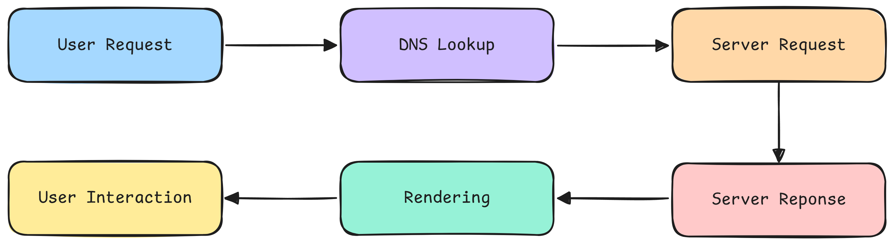
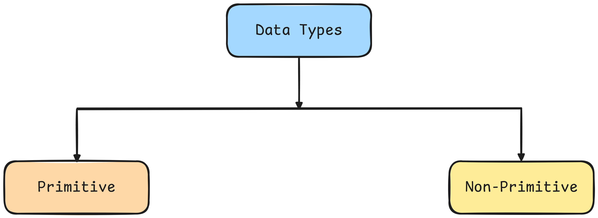
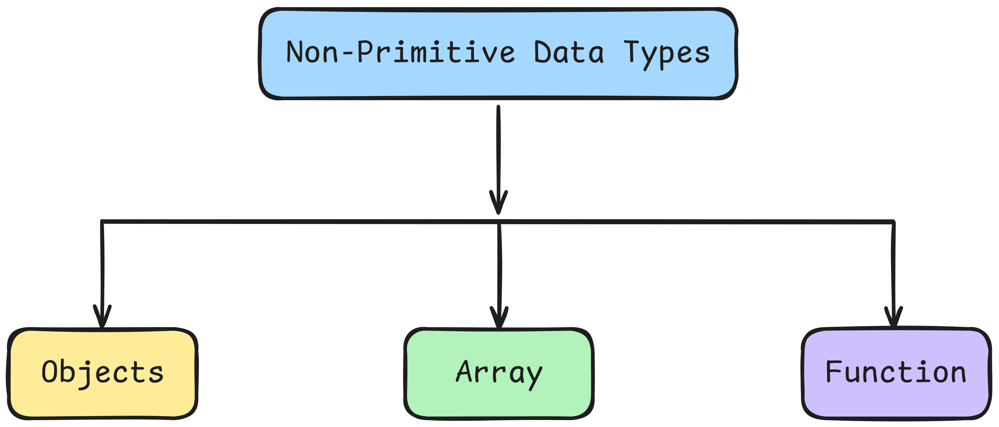
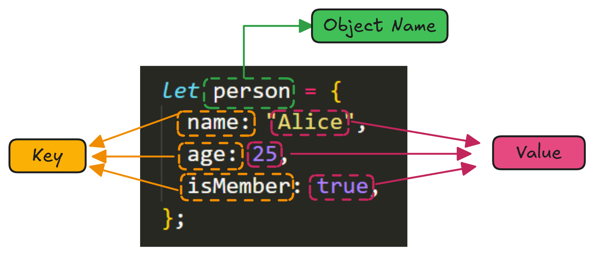
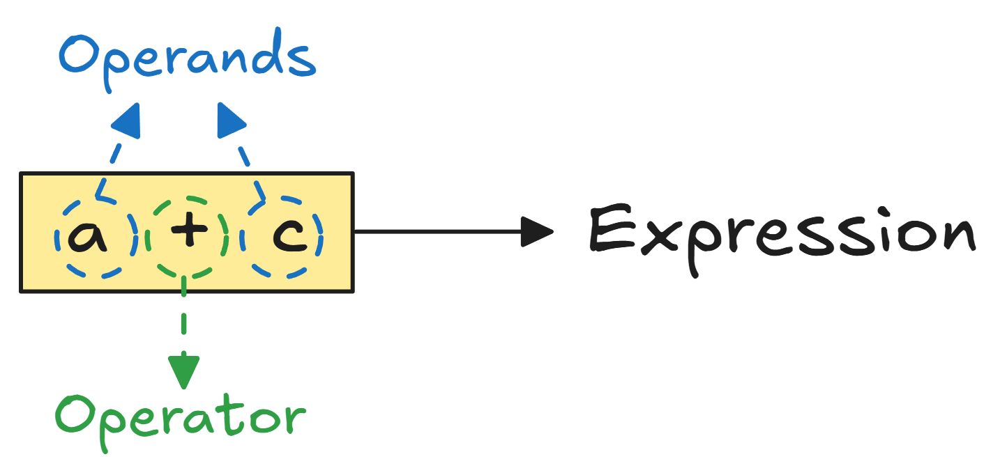
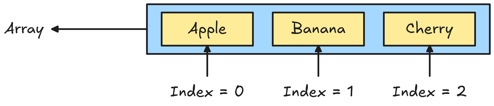

<!-- @format -->

d <!-- @format -->

# The JavaScript Handbook: A Beginner's Guide to Understanding JavaScript

<div align="center">
    
</div>

## What is JavaScript?

- **JavaScript** is a **Client Side Scripting Language** used to create **Dynamic** & **Interactive** content on websites.
- It works alongside **HTML** & **CSS** to build modern web applications.
- **JavaScript** is **Untested**, **Multi-Paradigm** & **Event-Driven** allowing developers to **build interactive user interfaces**.
- It is **Interpreted** by the browser’s **JavaScript Engine**, meaning it runs directly in the **browser** without **compilation**.

## JavaScript Features

- **Untyped** : Variables don't require a specific data type providing **flexibility** in usage.
- **Multi-Paradigm** : Supports **object-oriented**, **functional** & imperative programming styles.
- **Functional** : **Functions** are first-class citizens, enabling higher-order functions & functional - programming techniques.
- **Event-driven** : JavaScript reacts to user interactions like clicks, keypresses & other events in real time.
- **Interpreted** : **JavaScript** is interpreted by the browser’s engine enabling immediate execution of the code in the client-side environment.

## JavaScript Advantages

- **Less Server Interactions** : **JavaScript** allows tasks to be done in the browser **reducing** the need to communicate with the server which speeds up web pages.
- **Better Performance** : It runs directly in the browser making the **website faster** & **more responsive**.
- **Richer Interface** : **JavaScript** helps create engaging & interactive web pages with animations & real-time updates.
- **Increased Interactivity** : **JavaScript** makes websites more **interactive** by responding to user actions like clicks & keystrokes creating a better user experience.

## 🌐 How a Website Works?

A **website** is a **collection of web pages** stored on a **server**. When a user enters a **URL** the browser requests files from the server processes them & displays the webpage.

Here's a simplified workflow of how a website works:

1. User enters a URL in the browser.
2. Browser sends a request to the web server.
3. Server processes the request and sends back the necessary files (HTML, CSS, JavaScript).
4. Browser renders the website using these files.
5. User interacts with the website & JavaScript updates content dynamically.

> **Diagram of How a Website Works**

<div align="center">
    
</div>

### Explanation of the Workflow

- **User Request** → Enters a URL in the browser.
- **DNS Lookup** → Converts the domain name to an IP address.
- **Server Request** → Sends an HTTP request to the web server.
- **Server Response** → Sends back HTML, CSS & JavaScript files.
- **Rendering** → The browser processes and displays the webpage.
- **User Interaction** → JavaScript updates the page dynamically.

## 🖥 How a Browser Works with HTML, CSS & JavaScript?

A browser processes a webpage by handling **three** core technologies:

- **HTML** (**Structure**) → The browser parses HTML & builds the DOM (Document Object Model) defining the webpage structure.
- **CSS** (**Style**) → The browser processes CSS to create the CSSOM (CSS Object Model) applying styles to elements.
- **JavaScript** (**Behavior**) → JavaScript manipulates the DOM & CSSOM making the webpage interactive and dynamic.
- **Rendering Process** →
  - The browser combines the DOM & CSSOM into a Render Tree.
  - It calculates layout, determining element positions.
  - The painting process renders the final visual output on the screen.
  - This ensures that webpages load, display & function properly.

**_Example_**: When you click a button JavaScript modifies the HTML (DOM) & updates styles (CSSOM) dynamically.

## 🖥️ Running JavaScript in a Browser

In JavaScript, we can write and execute code inside an HTML file or in a separate JavaScript file.

### 🔹 Method 1: Internal JavaScript (Inside HTML)

We can write JavaScript directly inside the **`<script>`** tag in an **HTML** file.

> **Steps**

- Create an **`index.html`** file.
- Add JavaScript inside the **`<script>`** tag.
- Open the HTML file in a browser.

> **Example**

```javascript
    <!DOCTYPE html>
    <html>
    <head>
        <title>Internal JavaScript</title>
    </head>
    <body>
        <h1>Hello, World!</h1>
        <script>
            console.log("Hello, World! from Internal JavaScript");
        </script>
    </body>
    </html>
```

> **Output**

**Console Message** : "**`Hello, World! from Internal JavaScript`**" (View in **Console Tab**).

### 🔹 Method 2: External JavaScript (Separate File)

We can store JavaScript in a separate **`.js`** file & link it to the HTML file.

> **Steps**

- Create an **`index.html`** file.
- Create a **`script.js`** file in the same folder.
- Link the **`script.js`** file inside **`<script src="script.js"></script>`**
- Open **`index.html`** in a **browser**.

> **Example**

**index.html** (Linking External JS File)

```javascript

    <!DOCTYPE html>
    <html>
    <head>
        <title>External JavaScript</title>
    </head>
    <body>
        <h1>Hello, World!</h1>

        <!-- Link External JavaScript File -->
        <script src="script.js"></script>
    </body>
    </html>
```

**📄 script.js** (External JavaScript Code)

```javascript
    console.log("Hello, World! from script.js");
```

> **Output**

Console Message: "**`Hello, World! from script.js`**"

### 🎯Conclusion

- Use **Internal JavaScript** for **small scripts**.
- Use External JavaScript for clean, maintainable code.

## 📌Variables in JavaScript

A variable is a container used to store data that can be referenced and manipulated in a program.

### 🔹Key Concepts

- **Stores Data** : Holds values like numbers, text or objects.

- **Reusability** : Once stored the data can be used multiple times.

- **Dynamic Typing** : JavaScript variables do not require a fixed type they can hold different types of values at different times.

- **Memory Allocation** : The browser automatically manages memory for variables.

In JavaScript, variables are used to store data values. There are **Three Ways** to declare variables:

- **`var`**

- **`let`**

- **`const`**

Each has different rules for **scope**, **hoisting** & **reassigning values**.

### 1. `var`

Variable can be re-declared & updated. A global scope variable.

- **Scope :** Function-scoped. Limited to the function where it's declared

- **Hoisting :** **`var`** is **Hoisted** (moved to the top of the function or global scope) but the value is undefined until it's assigned.

- **Re-declaration :** Allowed in the same scope

- **Reassignment :** Allowed

- **Use Case :** Old way of declaring variables. **Not recommended in modern JavaScript**.

> **Example**

```javascript
    var name = "Pritam";
    console.log(name); // Output: Pritam

    var name = "Shuvo"; // Allowed (var can be redeclared)
    console.log(name); // Output: Shuvo
```

**_Note_** : **`var`** allows redeclaration which can cause unexpected issues.

### 2. `let`

Variable cannot be re-declared but can be updated.

- **Scope :** Block-scoped (limited to **`{ }`** block where it's declared)

- **Hoisting :** Hoisted but not initialized (ReferenceError if accessed before declaration)

- **Re-declaration :** Not allowed in the same scope

- **Reassignment :** Allowed

- **Use Case :** Use **`let`** when you expect the variable value to change

> **Example 01**

```javascript
    let age = 25;
    console.log(age); // Output: 25

    age = 30; // Allowed (value can change)
    console.log(age); // Output: 30

    // let age = 35; ❌ Error: Cannot redeclare 'age' in the same scope
```

**_Note_**: **`let`** prevents redeclaration but allows reassignment.

> **Example 02 : `let` Inside a Block `{}`**

```javascript
    {
        let message = "Hello, World!";
        console.log(message); // Output: Hello, World!
    }
    console.log(message); // Error: message is not defined
```

- The variable **`message`** exists only inside the block **`{}`**
- Trying to access **`message`** outside the block results in an error.

### 3. `const`

Variable cannot be re-declared or updated. A block scope variable.

- **Scope :** Block-scoped (like **`let`**)

- **Hoisting :** Hoisted but not initialized

- **Re-declaration :** Not allowed in the same scope

- **Reassignment :** Not allowed (constant value)

- **Use Case :** Use **`const`** when the value should not change

```javascript
    const PI = 3.1416;
    console.log(PI); // Output: 3.1416

    // PI = 3.14; Error: Cannot reassign a 'const' variable
```

**_Note_** : **`const`** prevents reassignment but doesn't make objects or arrays immutable

<div align="center">

### Summary Table

| **Feature**      | **`var`**         | **`let`**            | **`const`**                 |
| ---------------- | ----------------- | -------------------- | --------------------------- |
| Scope            | Function scope    | Block scope          | Block scope                 |
| Hoisting         | Yes ( undefined ) | Yes (TDZ)            | Yes (TDZ)                   |
| Re - declaration | Allowed           | Not allowed          | Not allowed                 |
| Reassignment     | Allowed           | Allowed              | Not allowed                 |
| Use              | Avoid using       | Use if value changes | Use if value stays constant |

**TDZ :** Temporal Dead Zone (Accessing before declaration throws error)

</div>

### Best Practice

- Use **`const`** by default unless the value needs to change.

- Use **`let`** when reassignment is needed.

- Avoid **`var`** to prevent scope-related issues.

**_Note_** : **`let`** & **`const`** help write **cleaner** and **safer** JavaScript code!

### 🔹Variable Naming Rules

> **Allowed**

- Can contain letters, digits, underscores **`_`** & dollar signs **`$`**.

- Must start with a letter, **`_`** or **`$`**

- Case-sensitive (**`name`** and **`Name`** are different).

> **Not Allowed**

- Cannot start with a number.

- Cannot use reserved JavaScript keywords (like **`var`**, **`let`**, **_`function`_**).

## 📌 Dynamically Typed Language

Dynamic Typing means that variables in JavaScript do not have a fixed data type. A variable can hold different types of values during execution.

### 🔹Example of Dynamic Typing

```bash
    value = "Hello";       # String (changed type)
    console.log(value);    # Output: Hello

    value = true;          # Boolean (changed type again)
    console.log(value);    # Output: true
```

- A single variable can change its type at runtime.

- No need to specify data types when declaring variables.

## 🔹 Key Features of Dynamic Typing

✅ No need to declare a specific type (string, number, etc.).

✅ The type of a variable can change at runtime.

✅ Flexible but can lead to unexpected bugs if not handled properly.

**_Note :_** Dynamic typing makes JavaScript flexible but requires careful handling to prevent type-related errors!

## 📌 Data Types in JavaScript

JavaScript has Two main categories of data types:

1. **Primitive Data Types**
2. **Non-Primitive (Reference) Data Types**
<div align="center">
    
</div>

### 1. 🔹Primitive Data Types

These are the basic types that hold simple data and are immutable (cannot be changed directly). When we assign a primitive value to a variable the value is copied. There are 7 Types of Primitive Data Types.

<div align="center">
    
</div>

#### 01. Number

- Represents both **Integers** & **Floating-Point** numbers.
- Examples: 10, 3.14

> **Example**

```javascript
    let age = 25;   // Integer
    let price = 99.99;  // Float
```

#### 02. String

- Represents sequences of characters (text).
- Examples: **`"Hello"`**, **`'World'`**
  > **Example**

```javascript
    let name = "Alice";
    let greeting = 'Hello, world!';
```

#### 03. Boolean

- Represents a **true** or **false** value.

```javascript
    let isTrue = true;
    let isFalse = false;
```

#### 04. Undefined

- A variable that has been declared but not assigned a value.
- Default value for uninitialized variables.

```javascript
    let value; // Undefined by default
```

#### 05. Null

- Represents intentional absence of any value.

```javascript
    let user = null;
```

#### 06. BigInt (ES11+)

- Used to represent large integers that cannot be handled by the Number type.

```javascript
    let bigNum = 1234567890123456789012345678901234567890n;
```

#### 07. Symbol (ES6+)

- A unique, immutable value often used for object property keys.
- Primarily used for unique identifiers.

```javascript
    let id = Symbol('id');
```

#### `null` and `undefined`

Both **`null`** and **`undefined`** represent the absence of a value but they are different in usage and behavior.

1. **`undefined`**

   - **Meaning:** A variable is declared but no value is assigned.
   - **Type:** **`undefined`**
   - **Default Value:** Variables declared but not initialized are undefined.
   - Who sets it? JavaScript automatically assigns **`undefined`**.

2. **`null`**
   - **Meaning:** Represents "no value" or "empty value". It is intentionally assigned by the programmer.
   - **Type:** **`object`** (This is a JavaScript bug that exists for historical reasons)
   - Who sets it? Programmer manually assigns **`null`**.

<div align="center">

#### Primitive Data Type Summary

| **Data Type** | **Description**                         | **Example**                        |
| ------------- | --------------------------------------- | ---------------------------------- |
| Number        | Numeric values                          | `10`, `3.14`                       |
| String        | Sequence of characters                  | `'Hello'`, `"World"`               |
| Boolean       | True or false                           | `true`, `false`                    |
| Undefined     | Variable declared but no value assigned | `let a;` `// undefined`            |
| Null          | Represents empty or unknown value       | `let a = null;`                    |
| Symbol (ES6)  | Unique and immutable value              | `const sym = Symbol('id');`        |
| BigInt (ES11) | Large integers beyond Number limit      | `let big = 12345678901234567890n;` |

</div>

### 2. 🔹Non-Primitive (Reference) Data Types

These are **complex types** that hold collections of data. Variables assigned to reference types store a reference (or pointer) to the data rather than the data itself. Changes to the data are reflected across all references.

<div align="center">
    
</div>

#### 01. Object

- A collection of key-value pairs (properties).
- Can store multiple values of different data types.
<div align="center">
    
</div>

```javascript
    let person = {
    name: "Alice",
    age: 25,
    isMember: true
    };
```

#### 02. Array

- An ordered list of values.
- Can store values of any data type.

```javascript
    let numbers = [1, 2, 3, 4, 5];
    let fruits = ["Apple", "Banana", "Cherry"];
```

#### 03. Function

- Functions are also objects in JavaScript.
- Used to define reusable code.

```javascript
    function greet() {
    console.log("Hello!");
    }
```

<div align="center">

#### Non-Primitive Data Type Summary

| **Data Type** | **Description**                  | **Example**                 |
| ------------- | -------------------------------- | --------------------------- |
| Object        | Collection of key-value pairs    | `{ name: "John", age: 30 }` |
| Array         | Ordered collection of values     | `[ 1, 2, 3, 4 ]`            |
| Function      | Block of code that can be called | `function greet() { }`      |

</div>

### Print Object Values in JavaScript

In JavaScript, we can print an object’s values using different methods depending on the format we need.

#### 01 Using `console.log()` (Simple Output)

✔ Prints the entire object in the console.

```javascript
    let person = { name: "Alice", age: 25, city: "New York" };
    console.log(person);
```

#### 02. Accessing Individual Properties

✔ Prints specific property values using dot notation (**`.`**).

```javascript
    console.log(person.name);  // Output: Alice
    console.log(person.age);   // Output: 25
    console.log(person.city);  // Output: New York
```

#### 03. Using Bracket Notation [] (When Property Name is Dynamic or Special)

✔ Useful when the key is stored in a variable or has special characters.

```javascript
    console.log(person["name"]);  // Output: Alice
    console.log(person["age"]);   // Output: 25
```

#### 04. Using `Object.values()` (Get Only Values)

✔ Extracts and prints only the values of an object.

```javascript
    console.log(Object.values(person));
    // Output: [ 'Alice', 25, 'New York' ]
```

<div align ="center">

## Summary Table

| Data Type | Category      | Description                      | Examples                                    |
| --------- | ------------- | -------------------------------- | ------------------------------------------- |
| Number    | Primitive     | Numeric values (Integer & Float) | `10`, `3.14`, `-5`                          |
| String    | Primitive     | Text data                        | `"Hello"`, `'World'`                        |
| Boolean   | Primitive     | True or false                    | `true`, `false`                             |
| Undefined | Primitive     | Variable not assigned a value    | `let x;`                                    |
| Null      | Primitive     | Intentional absence of value     | `null`                                      |
| Symbol    | Primitive     | Unique identifier                | `Symbol('id')`                              |
| BigInt    | Primitive     | Large integer                    | `1234567890123456789012345678901234567890n` |
| Object    | Non-Primitive | Collection of key-value pairs    | `{ name: "Alice", age: 25 }`                |
| Array     | Non-Primitive | Ordered list of values           | `[1, 2, 3]`, `["Apple", "Banana"]`          |
| Function  | Non-Primitive | Reusable block of code           | `function() { return "Hi"; }`               |

</div>

### 📌 Key Differences

- Primitive Data Types are immutable and directly store values.
- Non-Primitive Data Types are mutable and store a reference to the value.

**_Note_** : Primitive types are simpler and more efficient, while non-primitive types are more flexible for complex data structures.

### Check the Type of a Data Type in JavaScript

In JavaScript, we can use the **`typeof`** operator to **check the type of a variable** or expression. This helps us determine whether a value is a string, number, object, etc.

#### Example 1: Checking Primitive Data Types

```javascript
    let age = 25;
    console.log(typeof age);  // Output: number

    let name = "Alice";
    console.log(typeof name); // Output: string

    let isActive = true;
    console.log(typeof isActive); // Output: boolean

    let user = null;
    console.log(typeof user);  // Output: object (special case in JS)

    let value;
    console.log(typeof value);  // Output: undefined
```

#### Example 2: Checking Non-Primitive Data Types

```javascript
    let person = { name: "Alice", age: 25 };
    console.log(typeof person);  // Output: object

    let numbers = [1, 2, 3];
    console.log(typeof numbers);  // Output: object (arrays are also objects in JS)

    function greet() {
    console.log("Hello!");
    }
    console.log(typeof greet);  // Output: function
```

**_Note_** : Despite being a primitive value representing "no value," **`typeof null`** returns **`"object"`**. This is a known JavaScript quirk.

### Stack and Heap in JavaScript

JavaScript uses **two memory areas** to store data during program execution:

1. Stack
2. Heap

Both are important for understanding how memory works in JavaScript.

#### Stack (Call Stack / Execution Stack)

- **Definition:** Stack is a simple, fast memory structure used to store primitive data types and function calls.

- **Data Stored:**

  - Primitive data (Number, String, Boolean, Null, Undefined, Symbol, BigInt)
  - Function calls

- **Structure:** Last In, First Out (LIFO)

- **Speed:** Very fast

- **Data Access :** Copied by value

- **Automatic Memory Management:** Values are removed from the stack once the function execution is done.

#### Heap (Memory Heap)

- **Definition:** Heap is a large, slower memory area used to store non-primitive (reference) data types.
- **Data Stored:**

  - Objects

  - Arrays

  - Functions

- **Structure:** Random memory allocation

- **Speed:** Slower than Stack

- **Data Access :** Copied by reference

- **Manual / Garbage Collected:** JavaScript’s garbage collector frees up memory when it's no longer used.

## 📌 Datatype Conversion in JavaScript

Datatype conversion in JavaScript can sometimes be confusing because JavaScript automatically converts values in different situations. JavaScript performs two types of datatype conversions:

1. **Implicit Conversion** (Type Coercion) – Done automatically by JavaScript
2. **Explicit Conversion** (Type Casting) – Done manually by developers

### Implicit Conversion (Type Coercion)

JavaScript automatically converts data types in some operations.

#### 01 String Conversion

When adding a **number to a string** JavaScript **converts** the **number into a string**.

> **Example**

```javascript
    console.log("5" + 2); // "52" (Number converted to String)
    console.log("Hello" + true); // "Hellotrue" (Boolean converted to String)
```

#### 02 Number Conversion

When using mathematical operations (**`-`**, **`*`**, **`/`**) strings convert to numbers if possible.

> **Example**

```javascript
    console.log("10" - 2); // 8  (String "10" converted to Number)
    console.log("5" * "3"); // 15 (Both strings converted to Numbers)
    console.log("10" / "2"); // 5  (Both converted to Numbers)
    console.log("5" - "Hello"); // NaN (Cannot convert "Hello" to Number)
```

#### 03 Boolean Conversion

- Falsy values (**`""`**, **`0`**, **`null`**, **`undefined`**, **`NaN`**) convert to false.
- All other values convert to true.

> **Example**

```javascript
    console.log(Boolean("")); // false
    console.log(Boolean(0)); // false
    console.log(Boolean(1)); // true
    console.log(Boolean("Hello")); // true
```

### 03 Explicit Conversion (Type Casting)

Developers can manually convert data types using JavaScript methods.

#### 01. Convert to Number

Use **`Number()`**, **`parseInt()`** or **`parseFloat()`**.

> **Example**

```javascript
    console.log(Number("123")); // 123
    console.log(Number("123abc")); // NaN (Not a valid number)
    console.log(parseInt("123abc")); // 123 (Extracts only the number part)
    console.log(parseFloat("3.14")); // 3.14
    console.log(Number(true)); // 1
    console.log(Number(false)); // 0

```

#### 02. Convert to String

Use **`String()`** or **`.toString()`**.

> **Example**

```javascript
    console.log(String(123)); // "123"
    console.log(String(true)); // "true"
    console.log((100).toString()); // "100"
```

#### 03. Convert to Boolean

Use **`Boolean()`**.

> **Example**

```javascript
    console.log(Boolean(0)); // false
    console.log(Boolean(1)); // true
    console.log(Boolean("")); // false
    console.log(Boolean("Hello")); // true

```

### Best Practice

- Avoid relying on implicit conversions in complex operations.

- Always use explicit conversion when dealing with user inputs or mixed data types.

- Use **`Number()`**, **`String()`** & **`Boolean()`** for clarity.

## 📌 Comments in JavaScript

Comments in JavaScript help us write explanations within the code. They are ignored by the JavaScript engine & do not affect execution.

### 01. Single-Line Comment (`//`)

Used for short explanations or disabling a single line of code. Anything after **`//`** is ignored by JavaScript.

```javascript
    // This is a single-line comment
    let message = "Hello, World!"; // Another comment after code
```

### 2. Multi-Line Comment (`/* ... */`)

Used for longer explanations or temporarily disabling multiple lines of code. Everything inside **`/* ... */`** is ignored by JavaScript.

```javascript
    /* This is a multi-line comment.
   It can span multiple lines.
   Useful for detailed explanations. */
    let x = 10;
```

### Best Practices for Comments

✔ Keep them short & meaningful

✔ Use comments to explain why, not what (code should be self-explanatory)

✔ Avoid excessive comments that clutter code

✔ Use TODO comments for future improvements

## 📌 Operators in JavaScript

Operators in JavaScript are symbols that perform operations on values and variables. They can be used for mathematical calculations, comparisons, logical operations & more.

<div align="center">
    
</div>

### 1. Arithmetic Operators

Used for performing basic mathematical calculations.

<div align="center">
    
| Operator | Description | Example | Output |
|---|---|---|---|
| `+` | Addition | `5 + 3` | `8` |
| `-` | Subtraction | `10 - 4` | `6` |
| `*` | Multiplication | `6 * 2` | `12` |
| `/` | Division | `9 / 3` | `3` |
| `%` | Modulus (Remainder) | `10 % 3` | `1` |
| `**` | Exponentiation | `2 ** 3` | `8` |

</div>

> **Arithmetic Operator Example**

```javascript
    let a = 10, b = 3;
    console.log(a + b); // Output: 13
    console.log(a - b); // Output: 7
    console.log(a * b); // Output: 30
    console.log(a / b); // Output: 3.33
    console.log(a % b); // Output: 1
    console.log(a ** b); // Output: 1000
```

### 2. Increment & Decrement Operators

Increment (**`++`**) & decrement (**`--`**) operators are unary operators that modify a variable's value by 1.

#### Increment (`++`)

It adds **`1`** to a variable.
There are two types:

1. **Pre-Increment (`++x`)**
   Increases the value before returning it.
   ```javascript
        let a = 5;
        console.log(++a);  // Output: 6 (a is incremented first)
        console.log(a);    // Output: 6 (final value of a)
   ```
2. **Post-Increment (`x++`)**
   Returns the current value before increasing it.
   ```javascript
        let b = 5;
        console.log(b++);  // Output: 5 (returns old value, then increments)
        console.log(b);    // Output: 6 (final value of b)
   ```

#### Decrement (`--`)

It subtracts **`1`** from a variable.
There are two types:

1. **Pre-Decrement (`--x`)**
   Decreases the value before returning it.
   ```javascript
        let c = 5;
        console.log(--c);  // Output: 4 (c is decremented first)
        console.log(c);    // Output: 4 (final value of c)
   ```
2. **Post-Decrement (`x--`)**
   Returns the current value before decreasing it.
   ```javascript
        let d = 5;
        console.log(d--);  // Output: 5 (returns old value, then decrements)
        console.log(d);    // Output: 4 (final value of d)
   ```

<div align="center">

#### Summary

| **Operator** | **Description** | **Example**         | **Output (Initial `x = 5`)**             |
| ------------ | --------------- | ------------------- | ---------------------------------------- |
| `++x`        | Pre-increment   | `console.log(++x);` | `6` (increments first)                   |
| `x++`        | Post-increment  | `console.log(x++);` | `5` (returns old value, then increments) |
| `--x`        | Pre-decrement   | `console.log(--x);` | `4` (decrements first)                   |
| `x--`        | Post-decrement  | `console.log(x--);` | `5` (returns old value, then decrements) |

</div>

### 3. Assignment Operators

Assignment operators are used to assign values to variables. Basic Assignment operator are **`=`**. **`=`** assigns a value to a variable.

```javascript
    let x = 10;  // x is assigned 10
```

#### Compound Assignment Operators

These combine an arithmetic operation with assignment.

<div align="center">
    
| Operator | Example | Equivalent To | Description |
|---|---|---|---|
| `+=` | `x += 5;` | `x = x + 5;` | Adds and assigns |
| `-=` | `x -= 3;` | `x = x - 3;` | Subtracts and assigns |
| `*=` | `x *= 2;` | `x = x * 2;` | Multiplies and assigns |
| `/=` | `x /= 4;` | `x = x / 4;` | Divides and assigns |
| `%=` | `x %= 3;` | `x = x % 3;` | Modulus and assigns (remainder) |
| `**=` | `x **= 2;` | `x = x ** 2;` | Exponentiation and assigns |

</div>

### 4. Comparison Operators

Comparison operators are used to compare values. They return **`true`** or **`false`** based on the condition.

#### Equality and Inequality Operators

<div align="center">

| **Operator** | **Meaning**          | **Example** | **Result** |
| ------------ | -------------------- | ----------- | ---------- |
| `==`         | Equal to             | `5 == "5"`  | `true`     |
| `!=`         | Not equal to         | `5 != "5"`  | `false`    |
| `===`        | Equal to & same type | `5 === "5"` | `false`    |
| `!==`        | Not equal to & type  | `5 !== "5"` | `true`     |

</div>

**_Note_:** Use **`===`** & **`!==`** to avoid type conversion issues.

#### Relational Operators

<div align="center">

| **Operator** | **Meaning**              | **Example** | **Result** |
| ------------ | ------------------------ | ----------- | ---------- |
| `>`          | Greater than             | `10 > 5`    | `true`     |
| `<`          | Less than                | `10 < 5`    | `false`    |
| `>=`         | Greater than or equal to | `10 >= 10`  | `true`     |
| `<=`         | Less than or equal to    | `5 <= 10`   | `true`     |

</div>

#### Example

```javascript
    console.log(10 == "10");   // true (loose equality)
    console.log(10 === "10");  // false (strict equality)

    console.log(5 > 3);        // true
    console.log(5 < 3);        // false
    console.log(7 >= 7);       // true
    console.log(8 !== 8);      // false
```

**_Note_ :** Always use strict equality (**`===`)** for better accuracy!

### 5. Logical Operators

Logical operators are used to combine multiple conditions & return **`true`** or **`false`** based on the logic.

#### AND (`&&`) – Returns `true` only if both conditions are `true`

```javascript
    console.log(true && true);    // true
    console.log(true && false);   // false
    console.log(10 > 5 && 8 < 12); // true
```

#### OR (`||`) – Returns `true` if at least one condition is `true`

```javascript
    console.log(true || false);   // true
    console.log(false || false);  // false
    console.log(10 > 5 || 8 > 12); // true
```

#### NOT (`!`) – Reverses the boolean value

```javascript
    console.log(!true);  // false
    console.log(!false); // true
    console.log(!(10 > 5)); // false
```

**_Note_:** Use **`&&`** for strict conditions, **`||`** for flexible conditions & **`!`** to negate a condition.

## 📌 Conditional Statements in JavaScript

Conditional statements are used to make decisions in the code based on conditions.

<div align="center">

### Types of Conditional Statements

| Statement             | Description                                                    |
| --------------------- | -------------------------------------------------------------- |
| `if`                  | Executes a block of code if a condition is `true`.             |
| `if...else`           | Executes one block if condition is `true`, another if `false`. |
| `if...else if...else` | Checks multiple conditions sequentially.                       |
| `switch`              | Selects a block of code based on multiple cases.               |
| Ternary `? :`         | A shorthand for `if...else`.                                   |

</div>

### 🔹 1. if Statement

Executes only if the condition is **`true`**.

```javascript
    let age = 20;

    if (age >= 18) {
        console.log("You are an adult"); // Output: You are an adult
    }
```

### 🔹 2. if...else Statement

Executes different blocks for **`true`** or **`false`** conditions.

```javascript
    let age = 16;

    if (age >= 18) {
        console.log("You can vote");
    } else {
        console.log("You are too young to vote"); //Output: You are too young to vote
    }
```

### 🔹 3. if...else if...else Statement

Checks multiple conditions in order

```javascript
    let score = 85;

    if (score >= 90) {
        console.log("Grade: A");
    } else if (score >= 80) {
        console.log("Grade: B"); //Output: Grade: B
    } else {
        console.log("Grade: C");
    }
```

### 🔹 4. Switch Statement

Efficient when checking multiple values.

```javascript
    let day = 3;

    switch (day) {
        case 1: console.log("Monday"); break;
        case 2: console.log("Tuesday"); break;
        case 3: console.log("Wednesday"); break; //Output: Wednesday
        default: console.log("Invalid day");
}
```

### 🔹 5. Ternary Operator (? :)

Shorthand for **`if...else`**.

#### Syntax

```javascript
    condition ? "Expression If True" : :"Expression If False"
```

```javascript
    let age = 18;
    let result = (age >= 18) ? "Adult" : "Minor";
    console.log(result); //Output: Adult
```

**_Note :_** Use **`if...else `** for simple conditions, **`switch`** for multiple cases & ternary (**`? :`**) for short expressions.

## 📌 MDN Docs

We can find the official MDN (Mozilla Developer Network) documentation for JavaScript here:

🔗 [MDN JavaScript Overview](https://developer.mozilla.org/en-US/docs/Web/JavaScript/Guide)

MDN provides detailed explanations, examples & best practices for JavaScript concepts.

## `prompt()` Function for User Input

The `prompt()` function in JavaScript is used to display a dialog box that prompts the user for input. The dialog box contains a message & a text input field where the user can enter their response.

### Example for Printing User Name

```javascript
    let userName = prompt("What is your name?");
    if (userName !== null) {
        console.log("Hello, " + userName);
    } else {
        console.log("User cancelled the prompt.");
    }
```

### Example of if a number is a multiple of 5

```javascript
    // Prompt the user to enter a number
    let number = prompt("Enter a number to check if it's a multiple of 5:");

    // Check if the user entered a number and if it's a multiple of 5

    if (number % 5 === 0) {
    alert("The number " + number + " is a multiple of 5.");
    console.log("The number " + number + " is a multiple of 5.");
    } else {
    alert("The number " + number + " is not a multiple of 5.");
    console.log("The number " + number + " is NOT a multiple of 5.");
    }
```

## 📌 Loops in Javascript

Loops in JavaScript allow us to execute a block of code repeatedly based on a condition. They help automate repetitive tasks making our code efficient & reducing redundancy. JavaScript provides several types of loops, each serving different use cases. Let’s explore them in details

### 1. `for` Loop

The **`for`** loop is used when we know how many times we want to execute a block of code.

> **Suntax**

```javascript
    for (initialization; condition; increment/decrement) {
    // Code to execute
}
```

#### Explanation:

- **Initialization**: A variable is initialized.
- **Condition**: The loop runs as long as this condition is true.
- **Increment/Decrement**: The variable is updated after each iteration.

> **Example**

```javascript
    for (let i = 1; i <= 5; i++) {
    console.log("Iteration: " + i);
}
```

> **Output**

```output
    Iteration: 1
    Iteration: 2
    Iteration: 3
    Iteration: 4
    Iteration: 5
```

### 2.`while` Loop

The **`while`** loop is used when we do not know how many times the loop should run beforehand. It executes the block as long as the condition is **`true`**.

> **Syntax**

```javascript
    while (condition) {
    // Code to execute

}
```

> **Example**

```javascript
    let i = 1;
    while (i <= 5) {
        console.log("Iteration: " + i);
        i++;  // Incrementing to avoid an infinite loop
}

```

> **Output**

```output
    Iteration: 1
    Iteration: 2
    Iteration: 3
    Iteration: 4
    Iteration: 5
```

**_Note :_** Be careful with **`while`** loops—if the condition never becomes **`false`** the loop will run indefinitely causing an infinite loop.

### 3. `do...while` Loop

The **`do...while`** loop is similar to the while loop but guarantees that the block of code will execute at least once, even if the condition is **`false`**.

> **Syntax**

```javascript
    do {
        // Code to execute
    } while (condition);
```

> **Example**

```javascript
    let i = 1;
    do {
        console.log("Iteration: " + i);
        i++;
    } while (i <= 5);

```

> **Output**

```output
    Iteration: 1
    Iteration: 2
    Iteration: 3
    Iteration: 4
    Iteration: 5
```

#### When to Use?

- When we need to execute the block at least once before checking the condition.
- Useful when taking user input in forms.

### 4. `for...of` Loop (Iterating Over Arrays & Strings)

The **`for...of`** loop is used to iterate over iterable objects like arrays, strings, maps & sets.

> **Syntax**

```javascript
    for (let value of iterable) {
    // Code to execute
    }
```

> **Example with a String:**

```javascript
    let word = "Hello";
    for (let i of word) {
        console.log("i",i);
    }
```

> **Output**

```output
    i=H
    i=e
    i=l
    i=l
    i=o
```

### 5. `for...in` Loop (Iterating Over Object Properties)

The **`for...in`** loop is used to iterate over the keys (properties) of an **object**.

> **Syntax**

```javascript
    for (let key in object) {
    // Code to execute
    }
```

> **Example**

```javascript
    // for...in loop example

    let student = {
    name: "Pritam",
    age: 25,
    cgpa: 3.5,
    isPass: true,
    };

    for (let key in student) {
    console.log("key =", key, " value =", student[key]);
    }
```

> **Output**

```output
    key= name  value= Pritam
    key= age  value= 25
    key= cgpa  value= 3.5
    key= isPass  value= true
```

## 📌 Strings in Javascript

A string is a **sequence of characters** inside quotes:

- Single quotes **`(')`** → **`'Hello'`**
- Double quotes **`(")`** → **`"JavaScript"`**
- Backticks **` (``) `** → **`Template String`** (used for dynamic values)

<div align="center">

#### Common String Operations

| Method              | What It Does            | Example                                 |
| ------------------- | ----------------------- | --------------------------------------- |
| `length`            | Counts characters       | `"Hello".length` → `5`                  |
| `toUpperCase()`     | Converts to uppercase   | `"hello".toUpperCase()` → `"HELLO"`     |
| `toLowerCase()`     | Converts to lowercase   | `"HELLO".toLowerCase()` → `"hello"`     |
| `charAt(index)`     | Gets character at index | `"Hello".charAt(1)` → `"e"`             |
| `slice(start, end)` | Extracts part of string | `"Hello".slice(0, 4)` → `"Hell"`        |
| `replace(old, new)` | Replaces text           | `"Hello".replace("H", "J")` → `"Jello"` |
| `trim()`            | Removes spaces          | `" Hello ".trim()` → `"Hello"`          |

</div>

### Escape Characters in JavaScript

Escape characters allow us to add special characters inside a string that can’t be written directly.
We use a **backslash** (**`\`**) as the escape character.

<div align="center">

#### Common Escape Characters

| **Escape** | **Meaning**     | **Example**                   | **Output**              |
| ---------- | --------------- | ----------------------------- | ----------------------- |
| `\'`       | Single quote    | `'It\'s JavaScript'`          | It's JavaScript         |
| `\"`       | Double quote    | `"He said, \"Hello\""`        | He said, "Hello"        |
| `\\`       | Backslash       | `"This is a backslash: \\\\"` | This is a backslash: \  |
| `\n`       | New line        | `"Hello\nWorld"`              | Hello<br>World          |
| `\t`       | Tab space       | `"Hello\tWorld"`              | Hello World             |
| `\b`       | Backspace       | `"Hello\bWorld"`              | HellWorld               |
| `\r`       | Carriage return | `"Hello\rWorld"`              | World                   |

</div>

### Template Literals in JavaScript

Template literals are strings enclosed in backticks (**` `` `**) instead of single or double quotes. They allow embedded expressions and multi-line strings easily.

> **Example 01 : Basic**

**`${}`** is used to insert variables inside a string.

```javascript
    let name = "Pritam";
    console.log(`Hello, ${name}!`); // Output: Hello, Pritam!
```

> **Example 02 : Multi-line Strings**

Template literals support multi-line text without using **`\n`**

```javascript
    let message = `This is
    a multi-line
    string.`;
    console.log(message);
```

> **Output**

```output
    This is
    a multi-line
    string.
```

> **Example 03 : Expressions Inside `${}`**

We can include calculations, function calls, etc.:

```javascript
    let a = 10, b = 5;
    console.log(`Sum: ${a + b}`); // Output: Sum: 15
```

> **Example 04 : Function Calls Inside `${}`**

```javascript
    function greet(name) {
        return `Hello, ${name}!`;
    }
    console.log(`${greet("Pritam")}`); // Output: Hello, Pritam!

```

## 📌 Arrays in Javascript

An array is a special variable that holds multiple values in one single variable. Think of it as a list of items. Each item in the list has a specific position called an index. We declare arrays using square brackets **`[]`**.

```javascript
    let fruits = ['Apple', 'Banana', 'Cherry'];
```

Here, **`fruits`** is an array that contains 3 items.

### Array Indices

Every item in an array has a position known as its **index**. Indices are used to access and manipulate specific elements within the array.

- **Indexing Starts at 0**:
  In JavaScript, the index of an array starts from **0** not **1**. This means:

  - The **first element** is at **index 0**

  - The **second element** is at **index 1**

  - The **third element** is at **index 2** & so on.

<div align="center">
    
</div>

> **Example: Array with Indices**

```javascript
    let fruits = ['Apple', 'Banana', 'Cherry'];
    console.log(fruits[0]); // Apple
    console.log(fruits[1]); // Banana
    console.log(fruits[2]); // Cherry
```

### Accessing Array Elements

We access elements using the index (which starts from 0).

```javascript
    let firstFruit = fruits[0]; // Apple
    let secondFruit = fruits[1]; // Banana
```

### Modifying Array Elements

We can change the value of an element by directly assigning a new value to the index.

```javascript
    let fruits = ['Apple', 'Banana', 'Cherry'];
    fruits[1] = 'Orange'; // Now fruits = ['Apple', 'Orange', 'Cherry']
```

### Looping Through Arrays ~ the `for` Loop

The **`for`** loop is one of the most common ways to loop through arrays in JavaScript. It allows us to specify the starting point, condition & increment to control the iteration.

> **Syntax**

```javascript
    for (let i = 0; i < array.length; i++) {
    // Code to execute for each element
    }
```

- **`i`** is the index of the array.

- **`array.length`** ensures the loop runs until the last element.

> **Example**

```javascript
    let fruits = ['Apple', 'Banana', 'Cherry'];

    for (let i = 0; i < fruits.length; i++) {
    console.log(fruits[i]); // Outputs each fruit: Apple, Banana, Cherry
    }
```

- Starts with **` i = 0`**.

- Checks if **`i < fruits.length`**.

- Executes the code inside the loop using **`fruits[i]`**.

- Increments **`i`** by 1 each time, until the condition is false.

### Looping Through Arrays ~ the `for...of` Loop

The **`for...of`** loop is a newer and simpler way to iterate over arrays in JavaScript. It directly accesses the value of each element instead of using the index.

> **Syntax**

```javascript
    for (const element of array) {
  // Code to execute for each element
    }
```

- **`element`** is the actual value from the array not the index.

> **Example**

```javascript
    let fruits = ['Apple', 'Banana', 'Cherry'];

    for (const fruit of fruits) {
    console.log(fruit); // Outputs each fruit: Apple, Banana, Cherry
    }
```

- Iterates directly over the values in the array.

- No need to manage the index manually.

### Array Methods

JavaScript provides several built-in methods for working with arrays. These methods allow us to add, remove, modify & access elements within an array.

Suppose we have an array name **`fruits = ['Apple','Banana','Cherry']`**

<div align="center">

#### JavaScript Array Methods

| **Method**  | **Description**                                             | **Example**                                                                   | **Result**                                         |
| ----------- | ----------------------------------------------------------- | ----------------------------------------------------------------------------- | -------------------------------------------------- |
| `push()`    | Adds one or more items to the end of an array.              | `fruits.push('Mango');`                                                       | `['Apple', 'Banana', 'Cherry', 'Mango']`           |
| `pop()`     | Removes the last item from an array.                        | `fruits.pop();`                                                               | `['Apple', 'Banana', 'Cherry']`                    |
| `shift()`   | Removes the first item from an array.                       | `fruits.shift();`                                                             | `['Banana', 'Cherry']`                             |
| `unshift()` | Adds one or more items to the beginning of an array.        | `fruits.unshift('Pineapple');`                                                | `['Pineapple', 'Apple', 'Banana', 'Cherry']`       |
| `splice()`  | Adds or removes items from any position in the array.       | `fruits.splice(1, 1, 'Grapes');`                                              | `['Apple', 'Grapes', 'Cherry']`                    |
| `concat()`  | Combines two or more arrays into one.                       | `let newFruits = fruits.concat(['Mango', 'Papaya']);`                         | `['Apple', 'Banana', 'Cherry', 'Mango', 'Papaya']` |
| `slice()`   | Creates a shallow copy of a portion of the array.           | `let someFruits = fruits.slice(1, 3);`                                        | `['Banana', 'Cherry']`                             |
| `forEach()` | Executes a function for each item in the array.             | `fruits.forEach(fruit => console.log(fruit));`                                | `Apple, Banana, Cherry (printed one by one)`       |
| `map()`     | Creates a new array by applying a function to each element. | `let uppercaseFruits = fruits.map(fruit => fruit.toUpperCase());`             | `['APPLE', 'BANANA', 'CHERRY']`                    |
| `filter()`  | Creates a new array with items that pass a condition.       | `let longFruits = fruits.filter(fruit => fruit.length > 5);`                  | `['Banana', 'Cherry']`                             |
| `reduce()`  | Applies a function to reduce the array to a single value.   | `let totalLength = fruits.reduce((total, fruit) => total + fruit.length, 0);` | `16 (sum of lengths of all fruit names)`           |

</div>

## 📌 Function in Javascript

A function is a block of code designed to perform a particular task. Functions are one of the fundamental building blocks in JavaScript enabling code reusability & modularity.

### 01. Defining a Function

Functions are defined using the **`function`** keyword followed by a name parameters (optional) & a block of code enclosed in curly braces **`{}`**.

> **Syntax**

```javascript
    function functionName(parameter1, parameter2) {
        // Code to be executed
    }
```

- **`functionName`** is the name of the function.

- **`parameter1`**, **`parameter2`** are optional parameters (arguments) passed into the function.

> **Example**

```javascript
    function greet(name) {
    console.log("Hello, " + name + "!");
    }

    greet("Pritam"); // Outputs: Hello, Pritam!
```

### 02. Function with Return Value

A function can return a value using the **`return`** keyword.

> **Syntax**

```javascript
    function functionName(parameter1, parameter2) {
        return value; // Returns a value
    }
```

> **Example**

```javascript
    function add(a, b) {
        return a + b;
    }

    let result = add(3, 4);
    console.log(result); // Outputs: 7
```

- The function **`add`** returns the sum of two numbers.

### 03. Parameters and Arguments

- Parameters are placeholders for the values passed to the function when it is called.

- Arguments are the actual values passed to the function when it is called.

> **Example**

```javascript
    function greet(name) {
        console.log("Hello, " + name + "!");
    }

    greet("Pritam"); // "Pritam" is the argument
```

### 04. Default Parameters

Functions can have default parameter values if no argument is passed for that parameter.

> **Syntax**

```javascript
    function functionName(parameter1 = defaultValue) {
        // Code
    }
```

> **Example**

```javascript
    function greet(name = "Guest") {
        console.log("Hello, " + name + "!");
    }

    greet();      // Outputs: Hello, Guest!
    greet("Pritam");  // Outputs: Hello, Pritam!
```

- If no value is passed the parameter **`name`** defaults to "**`Guest`**".

### 05. Arrow Function

Arrow functions are a more concise way to write functions in JavaScript. They are particularly useful for shorter functions.

> **Syntax**

```javascript
    const functionName = (parameter1, parameter2) => {
        // Code to be executed
    };

```

> **Example**

```javascript
    const add = (a, b) => a + b;

    console.log(add(3, 4)); // Outputs: 7
```

### Why Are JavaScript Functions Special?

JavaScript functions are special because they are First-Class Citizens — meaning they are treated like any other value (number, string, object) in the language.

1. Functions Can Be Assigned to Variables

```javascript
    const greet = function() {
        console.log("Hello!");
    };
    greet();  // Output: Hello!

```

- Functions behave like data, so you can store them in variables.

2. Functions Can Be Passed as Arguments (Callback Functions)

```javascript
    function sayHello() {
        console.log("Hello!");
    }

    function execute(callback) {
        callback();
    }

    execute(sayHello);  // Output: Hello!

```

- Functions can be passed into other functions — this is how callbacks work.

4. Functions Are Objects

```javascript
    function example() {}
    console.log(typeof example);  // Output: function
    console.log(example instanceof Object); // true
```

- In JavaScript, functions are objects with properties and methods.
- Since functions are objects, they can be dynamically changed or extended.

## 📌 `forEach()` Loop in Arrays

**`forEach()`** is an array method used to loop through each element of an array. It runs a callback function once for every array element in order. **`forEach()`** does not return a new array. It just performs the operation.

> **Syntax**

```javascript
    array.forEach(function(element, index, array) {
        // Code to execute for each element
    });
```

- **element** → Current element

- **index** → (Optional) Index of the current element

- **array** → (Optional) The array itself

> **Example**

```javascript
    let fruits = ["Apple", "Banana", "Mango"];

    fruits.forEach(function(fruit, index) {
    console.log(index + ": " + fruit);
    });
```

> **Output**

```output
    0: Apple
    1: Banana
    2: Mango
```

### Arrow Function with `forEach()`

> **Example**

```javascript
    fruits.forEach((fruit) => console.log(fruit));
```

> **Output**

```output
    Apple
    Banana
    Mango
```

### Callback Function

A callback function is a function passed as an argument to another function. **`forEach()`** accepts a callback function and executes it for every array element.

> **Example of Callback in `forEach()`**

```javascript
    function printItem(item) {
        console.log(item);
    }

    let colors = ["Red", "Green", "Blue"];

    colors.forEach(printItem);
```

```output
    Red
    Green
    Blue
```

- **`forEach()`** does not return anything (undefined).

- You cannot break or continue inside **`forEach()`** like a normal loop.

- Best used when performing actions like printing or updating data.
