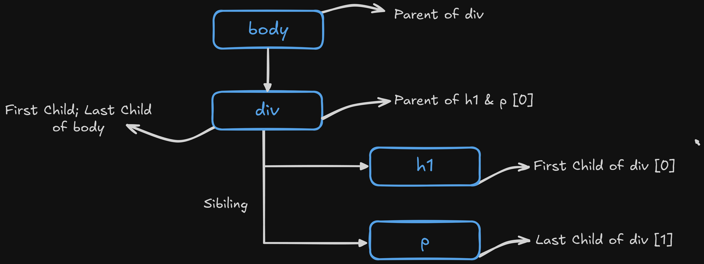

<!-- @format -->

<div align="center">

# DOM Explained with JavaScript

</div>

# What is DOM?

**DOM** stands for **Document Object Model**. It’s a **tree-like structure created by the browser** from the HTML document. Each HTML element becomes a **node** in the tree. JavaScript can use the DOM to access, change, add or remove elements on a webpage. When a web page is loaded the browser creates a **Document Object Model (DOM)** of the page.

# Why DOM is Important

It allows dynamic interaction with the webpage. We can:

- Change content (**`innerText`**, **`innerHTML`**)
- Change styles (**`style.color`**, **`style.backgroundColor`**)
- Respond to events (**`click`**, **`submit`**, etc.)
- Create or delete HTML elements

# Example of DOM Tree

<div align="center">
    
</div>

Here’s the **DOM tree structure** based on the HTML code from above image

<div align="center">
    
</div>

## Explanation

### 🌐 Top Level : Window

- Represents the **browser window**. It's the **global object** with lots of properties and methods for everything in the browser.
- Automatically created by Browser
- Everything—DOM, console, location etc. is accessed through the window.

### 📄 Document Level:

- Document Represents the HTML document loaded in the window.
- Acts as the root node of the DOM tree.
- You interact with the DOM via **`document`** in JavaScript.

### 🧱 Main Structure:

1. **`<html>`**

   - Child of **`document`**
   - The root HTML element of the page
   - Contains everything visible (head, body)

2. **`<head>`**

   - **`<title>`** ~ Contains a text node: "**`HTML for DOM`**"
   - **`<meta charset="UTF-8">`** ~ Self-closing tag with an attribute

3. **`<body>`**

   - Contains the main visible content of the page.

### 📦 Inside `<body> → <div class="attribute">`

This div has:

- 🔠 **`<h1>`** ~ Contains a text node: "**`Hello from HTML`**"

- 📝 **`<p>`** ~ Contains a text node: the paragraph content (like Lorem Ipsum)

<div align="center">

## Key Concepts

| Node Type    | Meaning                                           |
| ------------ | ------------------------------------------------- |
| Element Node | Any HTML tag like `<div>`, `<h1>`, etc.           |
| Text Node    | Actual content inside the elements                |
| Attribute    | Extra info inside opening tags like `class="..."` |

</div>

# 📘 Accessing and Exploring the DOM Using the Console

## Step 1: Open the Browser Console

- **Windows**: **`Ctrl + Shift + I`** → Go to Console tab

## Step 2: Type `window` & Press `Enter`

- This prints the global **`window`** object, which is the top-level object in the browser environment.

- It contains all global properties & methods such as:

  - **`window.document`** – the DOM object

  - **`window.location`** – the URL

  - **`window.console`** – for logging/debugging

  - and more...

## Step 3: Access the document Object

```javascript
   window.document
```

- This shows the document object, representing the current web page (DOM).

- The DOM (Document Object Model) is a **tree structure** of the HTML page.

## Step 4: Explore the Document Using `console.dir()`

```javascript
console.dir(window.document)
```

- This command prints the document as a full JavaScript object.

- Allows deep inspection of its properties and methods:

- **`.body`**, **`.head`**, **`.title`**, **`.createElement()`** etc.

- Useful for developers to inspect or manipulate the page content.

<div align="center">

### Comparison of `console.log()` and `console.dir()`

| Feature             | `console.log()`                            | `console.dir()`                               |
| ------------------- | ------------------------------------------ | --------------------------------------------- |
| **Purpose**         | Prints messages and values                 | Displays an object as a tree-like structure   |
| **Output Format**   | String representation (HTML-style for DOM) | JavaScript object (expandable)                |
| **Used For**        | Logging text, numbers, strings, objects    | Exploring object properties, especially DOM   |
| **DOM Elements**    | Shows as HTML element                      | Shows all properties/methods (node structure) |
| **Expandable View** | Limited object structure                   | Fully expandable and developer-friendly       |
| **Best Use Case**   | Quick message or simple data logging       | Deep object inspection (e.g., DOM nodes)      |

</div>

### Example

```javascript
console.log(document.body); // Shows: <body>...</body> (HTML format)

console.dir(document.body); // Shows: Object with properties like .children, .innerHTML, etc.
```

- Use **`console.log()`** to print simple messages or values.

- Use **`console.dir()`** when you want to explore object structure like a pro—especially useful when working with the DOM.

# 🔧 What is DOM Manipulation?

DOM manipulation allows JavaScript to **access**, **change**, **add** or **remove elements** & **content** in a webpage **dynamically** without reloading the page.

## 📋 Accessing the DOM

1. **`window`**

   - Represents the browser window. It’s the global object for everything in the browser.

   ```javascript
   window
   ```

2. **`window.document`**

   - Represents the entire HTML document (i.e., the webpage).

   ```javascript
   window.document
   ```

3. **`console.dir(window.document)`**

   - Shows the DOM object in a tree format, useful for exploring nodes and properties.

   ```javascript
   console.dir(window.document)
   ```

## 🔍 Selecting Elements in the DOM

### 1. Selecting with ID

Selects a single element by its unique **`id`**.

```javascript
document.getElementById("myId");
```

### 2. Selecting with Class

Returns a collection (HTMLCollection) of all elements with the given class name.

```javascript
document.getElementsByClassName("myClass");
```

### 3. Selecting with Tag

Returns a collection of elements with the given tag (like **`p`**, **`div`** etc.).

```javascript
document.getElementsByTagName("p");
```

### 4. Selecting with Query

Selects the **first matching element** using **CSS selectors** (id, class, tag, etc.)

```js
document.querySelector("selector")
```

<div align="center">

#### Example

| Selector Type   | Code Example                         | Notes                                                                       |
| --------------- | ------------------------------------ | --------------------------------------------------------------------------- |
| ID selector     | `document.querySelector("#myId")`    | Selects the first element with the ID `myId`                                |
| Class selector  | `document.querySelector(".myClass")` | Selects the first element with the class `myClass`                          |
| Tag selector    | `document.querySelector("p")`        | Selects the first `<p>` element                                             |
| Nested selector | `document.querySelector("div > p")`  | Selects the first `<p>` element that is a direct child of a `<div>` element |

</div>

To select all matching elements, use

```js
document.querySelectorAll("selector")
```

It will Returns a NodeList

### `console.dir()` After Selecting Elements

These commands return a reference to the DOM element(s) but they don’t show anything by default in the console unless:

- You're in the browser console, which may auto-display the return value.

- Or you explicitly output it using **`console.log()`** or **`console.dir()`**.

So, we usually follow up with

```js
const element = document.getElementById("myId");
console.dir(element);
```

- **`console.dir()`** gives a tree-like structure helping us explore the object's properties like **`innerHTML`**, **`style`**, etc.

- This is more useful for DOM inspection than **`console.log()`**.

## DOM Tree – Parent, Child & Sibling Relationships

In the DOM (Document Object Model), every HTML element is a node arranged in a tree structure.

<div align="center">

### Relationships

| Relationship | Meaning                     | Access Method (JS)                                               |
| ------------ | --------------------------- | ---------------------------------------------------------------- |
| Parent       | The element one level above | `element.parentNode`                                             |
| Child        | The element one level below | `element.children`                                               |
| First Child  | First element child         | `element.firstElementChild`                                      |
| Last Child   | Last element child          | `element.lastElementChild`                                       |
| Sibling      | Elements on the same level  | `element.nextElementSibling`<br>`element.previousElementSibling` |

</div>

<div align="center">
    
</div>

### Example HTML

```html
<div id="parent">
  <h1 id="child1">Hello</h1>
  <p id="child2">World</p>
</div>
```

### JavaScript Example

```js
const child = document.getElementById("child1");

// Parent
console.log(child.parentNode); // <div id="parent">

// Children
console.log(child.parentNode.children); // [<h1 id="child1">, <p id="child2">]

// Sibling
console.log(child.nextElementSibling); // <p id="child2">
```

## DOM Nodes

In the DOM, everything is a node — elements, text, comments, etc.
The DOM represents the HTML document as a tree of nodes.

<div align="center">

### Types of Nodes

| Node Type      | Description                                  | Example                |
| -------------- | -------------------------------------------- | ---------------------- |
| Element Node   | Represents HTML elements                     | `<div>`, `<p>`, `<ul>` |
| Text Node      | Represents text inside an element            | `Hello, World`         |
| Attribute Node | Represents attributes of elements            | `class="myClass"`      |
| Comment Node   | Represents HTML comments                     | ``                     |
| Document Node  | The root of the DOM tree (`window.document`) | The whole HTML page    |

</div>

### Example HTML

For this HTML

```html
<p class="greet">Hello World</p>
```

DOM Tree:

```vbnet
Document
 └── <p class="greet">  ← Element Node
      └── "Hello World" ← Text Node
```

## DOM Properties

These properties help us inspect and manipulate HTML elements using JavaScript.

<div align="center">

### Important Node Properties in the DOM

| Property                 | Description                                                | Example Output                          |
| ------------------------ | ---------------------------------------------------------- | --------------------------------------- |
| `nodeType`               | Returns the node type (1 = Element, 3 = Text, 8 = Comment) | `1`                                     |
| `nodeName`               | Returns the tag name or `#text`, `#comment`                | `"DIV"`, `"p"`, `"#text"`, `"#comment"` |
| `nodeValue`              | Returns the value of a text or comment node                | `"Hello world"`                         |
| `innerHTML`              | Gets or sets HTML inside the element                       | `"<span>Hi</span>"`                     |
| `outerHTML`              | Gets or sets the element and its HTML content              | `"<div><span>Hi</span></div>"`          |
| `textContent`            | Returns all text (including hidden and whitespace)         | `"Hi\n  "`                              |
| `innerText`              | Returns only visible text (respects CSS)                   | `"Hi"`                                  |
| `children`               | Returns only element children                              | `HTMLCollection`                        |
| `childNodes`             | Returns all nodes, including text nodes                    | `NodeList`                              |
| `parentNode`             | Returns the parent node                                    | `<div>`                                 |
| `firstChild`             | First node (could be text)                                 | `Node`                                  |
| `firstElementChild`      | First element node only                                    | `<span>`                                |
| `lastChild`              | Last node (could be text)                                  | `Node`                                  |
| `lastElementChild`       | Last element node only                                     | `<p>`                                   |
| `nextSibling`            | Next node (could be whitespace/text)                       | `Node`                                  |
| `nextElementSibling`     | Next element node only                                     | `<li>`                                  |
| `previousSibling`        | Previous node (could be text)                              | `Node`                                  |
| `previousElementSibling` | Previous element node only                                 | `<div>`                                 |

</div>

## Attributes in DOM

Attributes are HTML properties like **`href`**, **`src`**, **`alt`**, **`id`**, etc.We can get, set, or modify attributes using JavaScript.

```html
<a href="https://example.com" target="_blank">Visit</a>
```

**`href`** & **`target`** are attributes of the **`<a>`** tag.

<div align="center">

### Accessing Attributes in JavaScript

| Method              | Purpose                       | Example                                        |
| ------------------- | ----------------------------- | ---------------------------------------------- |
| `getAttribute()`    | Get the value of an attribute | `link.getAttribute("href")`                    |
| `setAttribute()`    | Set or change an attribute    | `link.setAttribute("href", "https://new.com")` |
| `removeAttribute()` | Remove an attribute           | `link.removeAttribute("target")`               |
| `hasAttribute()`    | Check if an attribute exists  | `link.hasAttribute("href")`                    |

</div>

### Example

```html

```

```js
const logo = document.getElementById("logo");

console.log(logo.getAttribute("src"));         // "logo.png"
logo.setAttribute("alt", "New-Logo");           // changes alt text
logo.removeAttribute("src");                    // removes the src
console.log(logo.hasAttribute("alt"));           // true

```

## Style in the DOM

Every HTML element has a **`.style`** property. We can use it to directly set or change the inline styles.

### Setting Style (Example)

```html
<div id="box">Hello</div>
```

```js
const box = document.getElementById("box");

box.style.color = "red";          // Text color
box.style.backgroundColor = "yellow"; // Background color
box.style.fontSize = "24px";       // Font size
box.style.padding = "10px";        // Padding
```

**_Note : Use camelCase for multi-word CSS properties (like `background-color` becomes `backgroundColor`)_**

### Getting a Style

**`.style`** only gets inline styles (styles set directly on the element). If you want to get computed styles (from external CSS also), use:

```js
const styles = getComputedStyle(box);
console.log(styles.color);             // Final applied color
console.log(styles.backgroundColor);   // Final background color
```

### Remove a Style

Set the property to an empty string:

```js
box.style.backgroundColor = "";
```

### Quick Example to Change Multiple Styles

```js
box.style.cssText = `
  color: white;
  background-color: black;
  padding: 20px;
  border-radius: 10px;
`;
```

## Inserting Elements into the DOM

Inserting elements means creating new HTML elements using JavaScript & adding them into the webpage dynamically without refreshing the page.
It helps us build, update or modify the webpage structure on the fly.s

We follow **Three** main steps:

1. **Create :** Create a new element using **`document.createElement()`**
2. **Modify :** Add text, attributes, styles or classes to the new element
3. **Insert :** Attach the element into the webpage (DOM) at the desired place

### 1. Create a New Element

We use:

```js
let newElement = document.createElement("tagName");
```

> **Example**

```js
let newDiv = document.createElement("div");
newDiv.textContent = "Hello World!";
```

### 2. Insert the Element into the Page

There are multiple ways to insert the created element:

<div align="left">

| Method                        | Meaning                             | Example                                      |
| ----------------------------- | ----------------------------------- | -------------------------------------------- |
| `appendChild()`               | Add at the **end** of parent        | `parent.appendChild(newDiv)`                 |
| `prepend()`                   | Add at the **start** of parent      | `parent.prepend(newDiv)`                     |
| `insertBefore(new, existing)` | Insert **before** an existing child | `parent.insertBefore(newDiv, existingChild)` |
| `append()`                    | Add multiple nodes or text          | `parent.append(newDiv, "some text")`         |
| `before()`                    | Insert **before** a given element   | `element.before(newDiv)`                     |
| `after()`                     | Insert **after** a given element    | `element.after(newDiv)`                      |

</div>

### 3. Example Full Flow

```html
<div id="container">
  <p>First Paragraph</p>
</div>
```

```js
// Step 1: Select the parent
const container = document.getElementById("container");

// Step 2: Create a new paragraph
const newPara = document.createElement("p");
newPara.textContent = "Second Paragraph";

// Step 3: Insert it
container.appendChild(newPara);
```

Now the container has two paragraphs.

### 4. Modify the New Element

After creating the element, we can modify it:

```js
newPara.className = "highlight";
newPara.id = "secondPara";
newPara.setAttribute("title", "This is the second paragraph");
```

<div align="center">

### `appendChild()` vs `append()`

| Feature               | `appendChild()` | `append()` |
| --------------------- | --------------- | ---------- |
| Insert only elements  | ✅              | ✅         |
| Insert text           | ❌              | ✅         |
| Insert multiple items | ❌              | ✅         |
| Returns inserted node | ✅              | ❌         |

</div>

- If you just want to **insert one element**, use **`appendChild()`**.
- If you want to **insert elements + text together**, use **`append()`**.

## Deleting Elements from the DOM

Deleting elements means removing existing HTML elements from the webpage structure (DOM) using JavaScript. It helps us dynamically clean up, update or modify the webpage when needed.

There are mainly **two ways** to delete an element:

1. **`.remove()`** : Directly removes the selected element itself.
2. **`.removeChild()`** : Removes a child element from its parent.

### 1. Remove an Element Directly using `.remove()`

- Simply select the element & call **`.remove()`** on it.

```js
let heading = document.querySelector("h1");
heading.remove();
```

The **`h1`** heading will be deleted from the page.

### 2. Remove a Child using .`removeChild()`

- Select the parent element.
- Then select the child you want to remove.
- Call .**`removeChild(child)`** on the parent.

```js
const container = document.getElementById("container");
const para = document.querySelector("p");
container.removeChild(para);
```

The selected paragraph (**`<p>`**) will be removed from the container.
