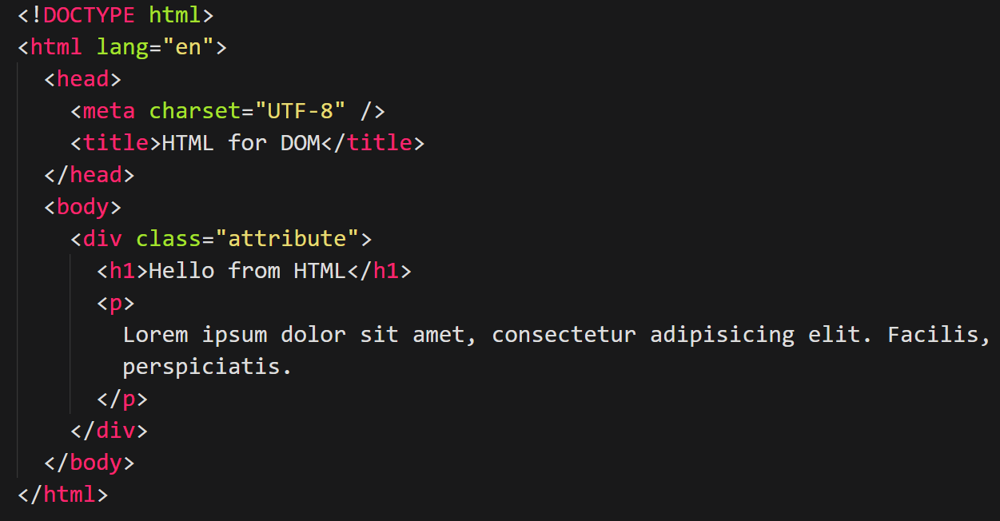
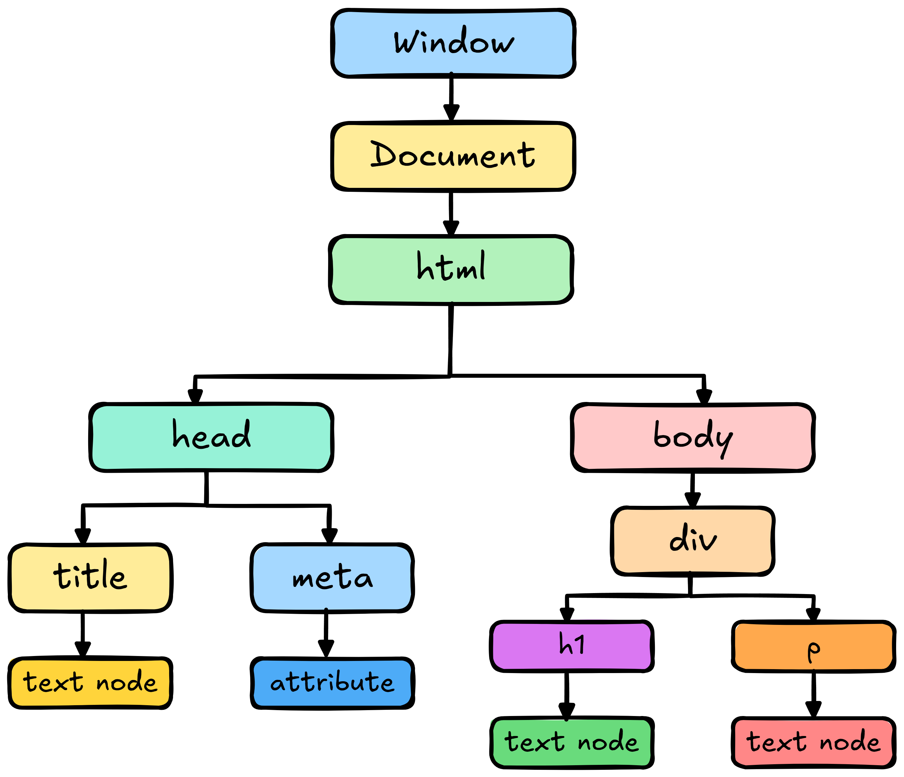
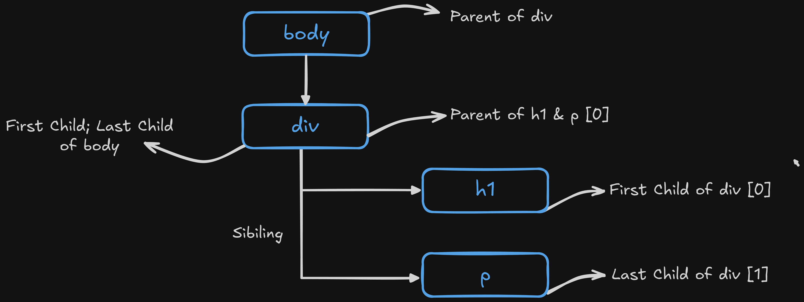

<!-- @format -->

<div align="center">

# DOM Explained with JavaScript

</div>

# What is DOM?

**DOM** stands for **Document Object Model**. It’s a **tree-like structure** created by the browser from the HTML document. Each HTML element becomes a node in the tree. JavaScript can use the DOM to access, change, add or remove elements on a webpage. When a web page is loaded the browser creates a Document Object Model (DOM) of the page.

# Why DOM is Important

It allows dynamic interaction with the webpage. We can:

- Change content (**`innerText`**, **`innerHTML`**)
- Change styles (**`style.color`**, **`style.backgroundColor`**)
- Respond to events (**`click`**, **`submit`**, etc.)
- Create or delete HTML elements

# Example of DOM Tree

<div align="center">
    
</div>

Here’s the **DOM tree structure** based on the HTML code from above image

<div align="center">
    
</div>

## Explanation

### 🌐 Top Level : Window

- Represents the **browser window**. It's the **global object** with lots of properties and methods for everything in the browser.
- Automatically created by Browser
- Everything—DOM, console, location etc. is accessed through the window.

### 📄 Document Level:

- Document Represents the HTML document loaded in the window.
- Acts as the root node of the DOM tree.
- You interact with the DOM via **`document`** in JavaScript.

### 🧱 Main Structure:

1. **`<html>`**

   - Child of **`document`**
   - The root HTML element of the page
   - Contains everything visible (head, body)

2. **`<head>`**

   - **`<title>`** ~ Contains a text node: "**`HTML for DOM`**"
   - **`<meta charset="UTF-8">`** ~ Self-closing tag with an attribute

3. **`<body>`**

   - Contains the main visible content of the page.

### 📦 Inside `<body> → <div class="attribute">`

This div has:

- 🔠 **`<h1>`** ~ Contains a text node: "**`Hello from HTML`**"

- 📝 **`<p>`** ~ Contains a text node: the paragraph content (like Lorem Ipsum)

<div align="center">

## Key Concepts

| Node Type    | Meaning                                           |
| ------------ | ------------------------------------------------- |
| Element Node | Any HTML tag like `<div>`, `<h1>`, etc.           |
| Text Node    | Actual content inside the elements                |
| Attribute    | Extra info inside opening tags like `class="..."` |

</div>

# 📘 Accessing and Exploring the DOM Using the Console

## Step 1: Open the Browser Console

- **Windows**: **`Ctrl + Shift + I`** → Go to Console tab

## Step 2: Type `window` & Press `Enter`

- This prints the global **`window`** object, which is the top-level object in the browser environment.

- It contains all global properties & methods such as:

  - **`window.document`** – the DOM object

  - **`window.location`** – the URL

  - **`window.console`** – for logging/debugging

  - and more...

## Step 3: Access the document Object

```javascript
   window.document
```

- This shows the document object, representing the current web page (DOM).

- The DOM (Document Object Model) is a tree structure of the HTML page.

## Step 4: Explore the Document Using `console.dir()`

```javascript
console.dir(window.document)
```

- This command prints the document as a full JavaScript object.

- Allows deep inspection of its properties and methods:

- **`.body`**, **`.head`**, **`.title`**, **`.createElement()`** etc.

- Useful for developers to inspect or manipulate the page content.

<div align="center">

### Comparison of `console.log()` and `console.dir()`

| Feature             | `console.log()`                            | `console.dir()`                               |
| ------------------- | ------------------------------------------ | --------------------------------------------- |
| **Purpose**         | Prints messages and values                 | Displays an object as a tree-like structure   |
| **Output Format**   | String representation (HTML-style for DOM) | JavaScript object (expandable)                |
| **Used For**        | Logging text, numbers, strings, objects    | Exploring object properties, especially DOM   |
| **DOM Elements**    | Shows as HTML element                      | Shows all properties/methods (node structure) |
| **Expandable View** | Limited object structure                   | Fully expandable and developer-friendly       |
| **Best Use Case**   | Quick message or simple data logging       | Deep object inspection (e.g., DOM nodes)      |

</div>

### Example

```javascript
console.log(document.body); // Shows: <body>...</body> (HTML format)

console.dir(document.body); // Shows: Object with properties like .children, .innerHTML, etc.
```

- Use **`console.log()`** to print simple messages or values.

- Use **`console.dir()`** when you want to explore object structure like a pro—especially useful when working with the DOM.

# 🔧 What is DOM Manipulation?

DOM manipulation allows JavaScript to **access**, **change**, **add** or **remove elements** & **content** in a webpage **dynamically** without reloading the page.

## 📋 Accessing the DOM

1. **`window`**

   - Represents the browser window. It’s the global object for everything in the browser.

   ```javascript
   window
   ```

2. **`window.document`**

   - Represents the entire HTML document (i.e., the webpage).

   ```javascript
   window.document
   ```

3. **`console.dir(window.document)`**

   - Shows the DOM object in a tree format, useful for exploring nodes and properties.

   ```javascript
   console.dir(window.document)
   ```

## 🔍 Selecting Elements in the DOM

### 1. Selecting with ID

Selects a single element by its unique **`id`**.

```javascript
document.getElementById("myId");
```

### 2. Selecting with Class

Returns a collection (HTMLCollection) of all elements with the given class name.

```javascript
document.getElementsByClassName("myClass");
```

### 3. Selecting with Tag

Returns a collection of elements with the given tag (like **`p`**, **`div`** etc.).

```javascript
document.getElementsByTagName("p");
```

### 4. Selecting with Query

Selects the **first matching element** using **CSS selectors** (id, class, tag, etc.)

```js
document.querySelector("selector")
```

<div align="center">

#### Example

| Selector Type   | Code Example                         | Notes                                                                       |
| --------------- | ------------------------------------ | --------------------------------------------------------------------------- |
| ID selector     | `document.querySelector("#myId")`    | Selects the first element with the ID `myId`                                |
| Class selector  | `document.querySelector(".myClass")` | Selects the first element with the class `myClass`                          |
| Tag selector    | `document.querySelector("p")`        | Selects the first `<p>` element                                             |
| Nested selector | `document.querySelector("div > p")`  | Selects the first `<p>` element that is a direct child of a `<div>` element |

</div>

To select all matching elements, use

```js
document.querySelectorAll("selector")
```

It will Returns a NodeList

### `console.dir()` After Selecting Elements

These commands return a reference to the DOM element(s) but they don’t show anything by default in the console unless:

- You're in the browser console, which may auto-display the return value.

- Or you explicitly output it using **`console.log()`** or **`console.dir()`**.

So, we usually follow up with

```js
const element = document.getElementById("myId");
console.dir(element);
```

- **`console.dir()`** gives a tree-like structure helping us explore the object's properties like **`innerHTML`**, **`style`**, etc.

- This is more useful for DOM inspection than **`console.log()`**.

## DOM Tree – Parent, Child & Sibling Relationships

In the DOM (Document Object Model), every HTML element is a node arranged in a tree structure.

<div align="center">

### Relationships

| Relationship | Meaning                     | Access Method (JS)                                               |
| ------------ | --------------------------- | ---------------------------------------------------------------- |
| Parent       | The element one level above | `element.parentNode`                                             |
| Child        | The element one level below | `element.children`                                               |
| First Child  | First element child         | `element.firstElementChild`                                      |
| Last Child   | Last element child          | `element.lastElementChild`                                       |
| Sibling      | Elements on the same level  | `element.nextElementSibling`<br>`element.previousElementSibling` |

</div>

<div align="center">
    
</div>

### Example HTML

```html
<div id="parent">
  <h1 id="child1">Hello</h1>
  <p id="child2">World</p>
</div>
```

### JavaScript Example

```js
const child = document.getElementById("child1");

// Parent
console.log(child.parentNode); // <div id="parent">

// Children
console.log(child.parentNode.children); // [<h1 id="child1">, <p id="child2">]

// Sibling
console.log(child.nextElementSibling); // <p id="child2">
```

## DOM Nodes

In the DOM, everything is a node — elements, text, comments, etc.
The DOM represents the HTML document as a tree of nodes.

<div align="center">

### Types of Nodes

| Node Type      | Description                                  | Example                |
| -------------- | -------------------------------------------- | ---------------------- |
| Element Node   | Represents HTML elements                     | `<div>`, `<p>`, `<ul>` |
| Text Node      | Represents text inside an element            | `Hello, World`         |
| Attribute Node | Represents attributes of elements            | `class="myClass"`      |
| Comment Node   | Represents HTML comments                     | ``                     |
| Document Node  | The root of the DOM tree (`window.document`) | The whole HTML page    |

</div>

### Example HTML

For this HTML

```html
<p class="greet">Hello World</p>
```

DOM Tree:

```vbnet
Document
 └── <p class="greet">  ← Element Node
      └── "Hello World" ← Text Node
```

## DOM Properties

These properties help us inspect and manipulate HTML elements using JavaScript.

<div align="center">

### Important Node Properties in the DOM

| Property                 | Description                                                | Example Output                          |
| ------------------------ | ---------------------------------------------------------- | --------------------------------------- |
| `nodeType`               | Returns the node type (1 = Element, 3 = Text, 8 = Comment) | `1`                                     |
| `nodeName`               | Returns the tag name or `#text`, `#comment`                | `"DIV"`, `"p"`, `"#text"`, `"#comment"` |
| `nodeValue`              | Returns the value of a text or comment node                | `"Hello world"`                         |
| `innerHTML`              | Gets or sets HTML inside the element                       | `"<span>Hi</span>"`                     |
| `outerHTML`              | Gets or sets the element and its HTML content              | `"<div><span>Hi</span></div>"`          |
| `textContent`            | Returns all text (including hidden and whitespace)         | `"Hi\n  "`                              |
| `innerText`              | Returns only visible text (respects CSS)                   | `"Hi"`                                  |
| `children`               | Returns only element children                              | `HTMLCollection`                        |
| `childNodes`             | Returns all nodes, including text nodes                    | `NodeList`                              |
| `parentNode`             | Returns the parent node                                    | `<div>`                                 |
| `firstChild`             | First node (could be text)                                 | `Node`                                  |
| `firstElementChild`      | First element node only                                    | `<span>`                                |
| `lastChild`              | Last node (could be text)                                  | `Node`                                  |
| `lastElementChild`       | Last element node only                                     | `<p>`                                   |
| `nextSibling`            | Next node (could be whitespace/text)                       | `Node`                                  |
| `nextElementSibling`     | Next element node only                                     | `<li>`                                  |
| `previousSibling`        | Previous node (could be text)                              | `Node`                                  |
| `previousElementSibling` | Previous element node only                                 | `<div>`                                 |

</div>
