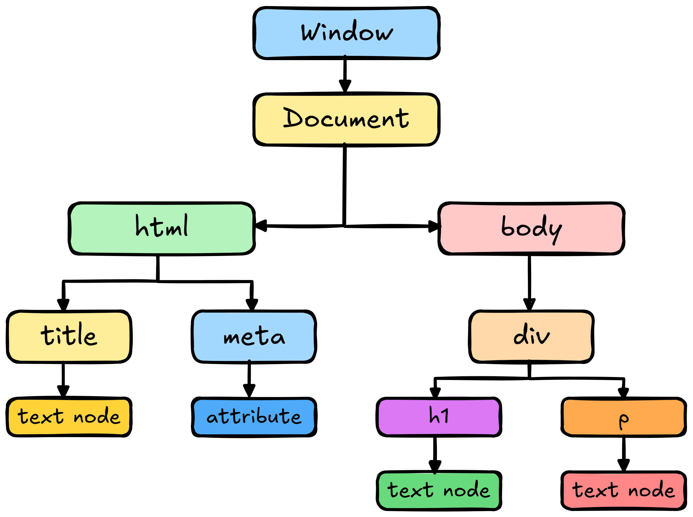

<!-- @format -->

# DOM Explained with JavaScript

# What is DOM?

**DOM** stands for **Document Object Model**. It’s a **tree-like structure** created by the browser from the HTML document. Each HTML element becomes a node in the tree. JavaScript can use the DOM to access, change, add or remove elements on a webpage. When a web page is loaded the browser creates a Document Object Model (DOM) of the page.

# Why DOM is Important

It allows dynamic interaction with the webpage. We can:

- Change content (**`innerText`**, **`innerHTML`**)
- Change styles (**`style.color`**, **`style.backgroundColor`**)
- Respond to events (**`click`**, **`submit`**, etc.)
- Create or delete HTML elements

# Example of DOM Tree

    

Here’s the **DOM tree structure** based on the HTML code from above image

    

## Explanation

### 🌐 Top Level : Window

- Represents the browser window. It's the **global object** with lots of properties and methods for everything in the browser.
- Automatically created by Browser
- Everything—DOM, console, location etc. is accessed through the window.

### 📄 Document Level:

- Document Represents the HTML document loaded in the window.
- Acts as the root node of the DOM tree.
- You interact with the DOM via **`document`** in JavaScript.

### 🧱 Main Structure:

1. **`<html>`**
   - Child of **`document`**
   - The root HTML element of the page
   - Contains everything visible (head, body)
2. **`<head>`** is implied here but not shown — only children like:

   - **`<title>`** ~ Contains a text node: "**`HTML for DOM`**"
   - **`<meta charset="UTF-8">`** ~ Self-closing tag with an attribute

3. **`<body>`**
   - Contains the main visible content of the page.

### 📦 Inside `<body> → 
`

This div has:

- 🔠 **`<h1>`** ~ Contains a text node: "**`Hello from HTML`**"

- 📝 **`
`** ~ Contains a text node: the paragraph content (like Lorem Ipsum)

## Key Concepts

| Node Type    | Meaning                                           |
| ------------ | ------------------------------------------------- |
| Element Node | Any HTML tag like `
`, `<h1>`, etc.           |
| Text Node    | Actual content inside the elements                |
| Attribute    | Extra info inside opening tags like `class="..."` |

